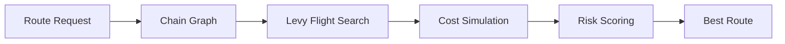

# REVY -- Levy Flight Cross-Chain Routing Engine

Cross-chain routing powered by the Levy Flight search algorithm -- a mathematically optimal foraging strategy observed in apex predators, now applied to discovering the cheapest token transfer paths across 20+ blockchain networks.

Every bridge checks 3-5 direct routes and returns the cheapest. Nobody asks: what if going through 2 intermediate chains is 40% cheaper? What if the direct route doesn't exist at all? Revy answers both questions.

---

## How It Works

The engine implements a 5-layer pipeline:

1. **Territory Mapping** -- Chain graph with 20 chains, 61 bridge connections, gas and fee metadata
2. **Levy Flight Pathfinding** -- Power-law distributed random walk (mu=2.0, 300 iterations)
3. **Cost Simulation** -- Per-hop gas, bridge fees, slippage, and protocol fee calculation
4. **Risk Scoring** -- Hop-count penalty with non-linear acceleration
5. **Route Optimization** -- Deduplication, filtering, and risk-adjusted ranking

---

## Benchmark Results
