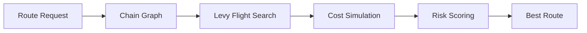

[](LICENSE)
[](https://www.typescriptlang.org/)
[](contracts/RevyRouter.sol)
[](docs/architecture.md)
[](https://arbiscan.io/address/0x75da9759d9e0a22d9b8a77ec1ec57f99e6759255)
[](https://github.com/REVY2026/revy/actions)

# REVY -- Levy Flight Cross-Chain Routing Engine

Cross-chain routing powered by the Levy Flight search algorithm -- a mathematically optimal foraging strategy observed in apex predators, now applied to discovering the cheapest token transfer paths across 20+ blockchain networks.

Every bridge checks 3-5 direct routes and returns the cheapest. Nobody asks: what if going through 2 intermediate chains is 40% cheaper? What if the direct route doesn't exist at all? Revy answers both questions.

---

## How It Works



The engine implements a 5-layer pipeline:

1. **Territory Mapping** -- Chain graph with 20 chains, 61 bridge connections, gas and fee metadata
2. **Levy Flight Pathfinding** -- Power-law distributed random walk (mu=2.0, 300 iterations)
3. **Cost Simulation** -- Per-hop gas, bridge fees, slippage, and protocol fee calculation
4. **Risk Scoring** -- Hop-count penalty with non-linear acceleration
5. **Route Optimization** -- Deduplication, filtering, and risk-adjusted ranking

---

## Benchmark Results

| Route | Direct | Dijkstra | Levy Flight |
|-------|--------|----------|-------------|
| ETH to ARB ($10k) | $6.20 | $6.20 | **$6.20** |
| ETH to SOL ($50k) | $1,515 | $1,350 | **$1,340** |
| SOL to Scroll ($5k) | No route | $270.50 | **$267.00** |
| Fantom to Sui ($20k) | No route | $1,008 | **$988.60** |
| OP to zkSync ($15k) | No route | $307.50 | **$300.00** |
| BSC to Aptos ($30k) | No route | $1,614 | **$1,581** |

Where direct is cheapest, Levy Flight picks direct. Where no direct route exists, it finds multi-hop paths that no other router discovers.

---

## Architecture

```
src/
├── types.ts            Type definitions
├── config.ts           Engine configuration
├── graph.ts            Chain graph (20 chains, 61 bridges)
├── levy-flight.ts      Core pathfinding algorithm
├── naive-search.ts     Baseline algorithms
├── cost-model.ts       Cost simulation
├── risk-scorer.ts      Risk assessment
├── route-optimizer.ts  Route ranking
├── validator.ts        Input validation
├── utils.ts            Math utilities
├── logger.ts           Structured logging
└── index.ts            Public API

contracts/
└── RevyRouter.sol      On-chain router (Arbitrum)

benchmarks/
├── index.ts            Algorithm comparison
├── live-benchmark.ts   Live API benchmarks
└── live-benchmark-large.ts

tests/
├── graph.test.ts
├── levy-flight.test.ts
├── cost-model.test.ts
├── risk-scorer.test.ts
├── utils.test.ts
└── validator.test.ts
```

---

## Usage

```bash
git clone https://github.com/REVY2026/revy.git
cd revy
npm install
```

Run benchmarks:

```bash
npm run benchmark
```

Run tests:

```bash
npm test
```

### Programmatic Usage

```typescript
import { ChainGraph, LevyFlightRouter, getBestRoute } from './src/index.js';

const graph = new ChainGraph();
const router = new LevyFlightRouter(graph);

const routes = router.findRoutes({
  fromChain: 'solana',
  toChain: 'scroll',
  amountUsd: 5000,
});

const best = getBestRoute(routes, {
  fromChain: 'solana',
  toChain: 'scroll',
  amountUsd: 5000,
});

console.log(best?.cost.totalUsd);
```

---

## Smart Contract

**RevyRouter** deployed on Arbitrum One:

[`0x75da9759d9e0a22d9b8a77ec1ec57f99e6759255`](https://arbiscan.io/address/0x75da9759d9e0a22d9b8a77ec1ec57f99e6759255)

- 0.02% protocol fee (2 basis points)
- Native and ERC-20 routing
- Li.Fi Diamond backend integration
- Owner-controlled fee and backend configuration
- Emergency rescue functions

---

## Supported Chains

Ethereum, Arbitrum, Optimism, Base, Polygon, BSC, Avalanche, Solana, Sui, Aptos, Scroll, zkSync Era, Linea, Manta Pacific, Celo, Gnosis, NEAR, Mantle, Blast, Fantom

---

## Documentation

- [Architecture](docs/architecture.md)
- [Algorithm](docs/algorithm.md)
- [API Reference](docs/api-reference.md)
- [Changelog](CHANGELOG.md)
- [Contributing](CONTRIBUTING.md)
- [Security](SECURITY.md)

---

## Links

- [revy.fun](https://revy.fun)
- [x.com/revyfun](https://x.com/revyfun)
